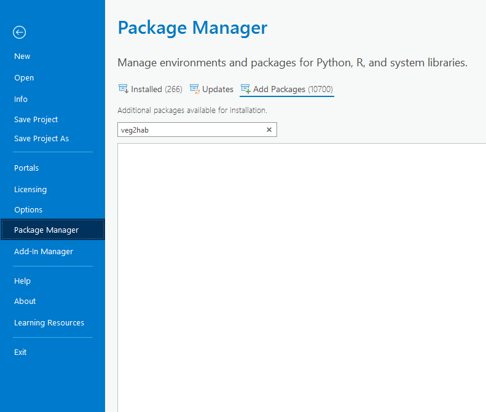
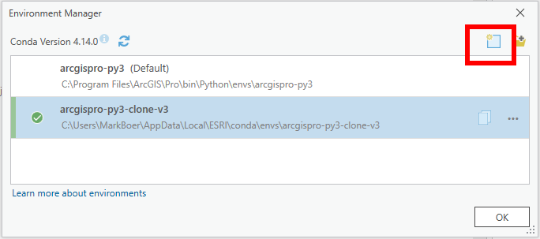
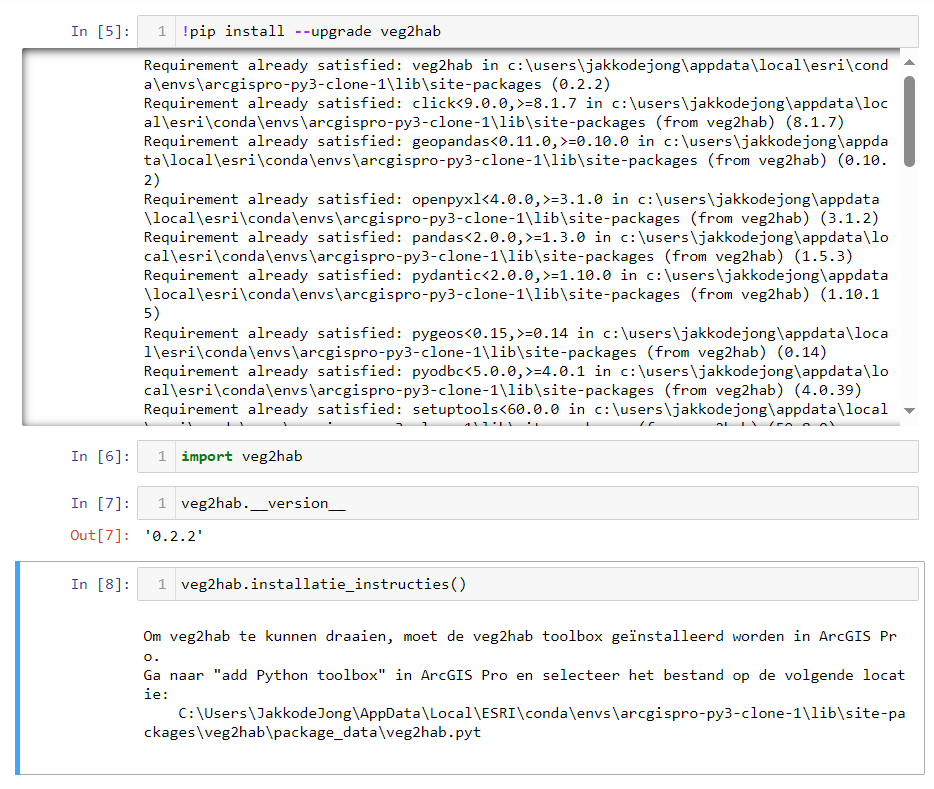
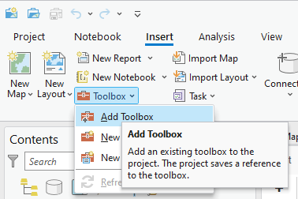
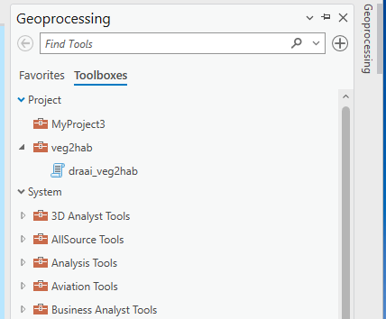

# veg2hab

- [veg2hab](#veg2hab)
  - [Introductie](#introductie)
  - [Installatie instructies](#installatie-instructies)
    - [Installatie binnen ArcGIS Pro](#installatie-binnen-arcgis-pro)
    - [Installatie op linux](#installatie-op-linux)
  - [Gebruikershandleiding](#gebruikershandleiding)
    - [Gebruik in ArcGIS Pro](#gebruik-in-arcgis-pro)
    - [Bronbestanden die veg2hab gebruikt](#bronbestanden-die-veg2hab-gebruikt)
  - [Development](#development)
    - [Lokale ontwikkeling](#lokale-ontwikkeling)
    - [Nieuwe release](#nieuwe-release)
  - [Interpretatie van de output-habitattypekartering](#interpretatie-van-de-output-habitattypekartering)
    - [Vlakbrede kolommen](#vlakbrede-kolommen)
    - [Complex-deel-specifieke kolommen](#complex-deel-specifieke-kolommen)

## Introductie

**veg2hab** zet Nederlandse vegetatietypekarteringen automatisch om naar habitattypekarteringen. De library kan op 3 manieren gebruikt worden:

- Als functionaliteit binnen andere (python) software;
- Met de meegeleverde Command Line Interface;
- Vanuit ArcGIS Pro.

veg2hab wordt gedistribueerd via PyPI, waar alle historische versies te vinden zijn.

## Installatie instructies

### Installatie binnen ArcGIS Pro

Gebruik van veg2hab is ontwikkeld voor en getest in ArcGIS Pro versie 3.0 en hoger. 
Installatie vanaf PyPI is veruit het eenvoudigst, en wordt hieronder omschreven: 

 1. Open ArcGIS Pro
 2. Maak een nieuwe python environment aan voor veg2hab (de default conda environment is read-only en niet geschikt om veg2hab in te installeren): 
    - Open de 'Package Manager'  
        
    - Klik op het tandwiel naast 'Active Environment'  
    - Maak een nieuwe environment aan op een locatie naar keuze. Gebruik als 'Source' de default Environment.  
          
        
    - Selecteer de environment en druk op 'OK'.
 3. Download en installeer veg2hab:
    - Klik op 'New notebook'  
        
    - Download veg2hab met het commando `!pip install --upgrade veg2hab`  
        
    - Installeer veg2hab met het commando `import veg2hab`
 4. Installeer de veg2hab Python Toolbox:
    - Gebruik het commando `veg2hab.installatie_instructies()` om de locatie van de toolbox te vinden
    - Ga naar 'Add Toolbox (file)' en voeg de toolbox toe vanaf de locatie  
        

Als het goed is, wordt de veg2hab toolbox nu getoond in de Geoprocessing tab:




### Installatie op linux
Op linux heeft veg2hab een extra dependency. Pyodbc kan namelijk niet overweg met .mdb files op linux, dus gebruiken we hiervoor de `mdb-export` tool. Deze is te installeren met:
```sh
apt install mdbtools
```
voor meer informatie, zie: https://github.com/mdbtools/mdbtools

## Gebruikershandleiding

### Gebruik in ArcGIS Pro

Veg2hab komt met twee opties `digitale_standaard` en `vector_bestand`, afhankelijk van het formaat waarin de vegetatietype beschikbaar is. We willen iedereen aanraden de digitale standaard te gebruiken, wanneer dit mogelijk is.


### Bronbestanden die veg2hab gebruikt

**veg2hab** is afhankelijk van verschillende bronbestanden tijdens het omzetten van vegetatiekarteringen. 

Sommige bestanden zijn landelijk beschikbaar. Deze bestanden worden automatisch mee geïnstalleerd met veg2hab en zijn niet aanpasbaar door de gebruiker: 

 - WasWordtLijst (versie 09-feb-2021): dit bestand wordt gebruikt om landelijke vegetatietypologieën in elkaar om te zetten
 - DefinitieTabel (versie 24 maart 2009): dit is een samenvatting van de profieldocumenten
 - Fysisch-Geografische Regio kaart (versie xxxxx)
 - Let op voor nieuwe versies: er komen nog meer bronbestanden bij!


## Development
### Lokale ontwikkeling
Download de git repository:
```sh
git clone https://github.com/Spheer-ai/veg2hab
```

En installeer alle lokale (developmment) dependencies met:
```sh
poetry install
```

Binnen het project zijn onderstaande stappen gevolgd om deze data in te lezen:
- Clone de volgende repo: https://github.com/pavlov99/mdb-export-all
- Gebruik het bash script om .mdb files om te zetten naar een map met csv bestanden
- De SBB-codes staan in Element.csv

Linting doen we met isort en black:
```sh
poetry run black .
poetry run isort .
```

Unittests worden gedraaid met pytest:
```sh
poetry run pytest tests/
```

### Nieuwe release
1. Zorg ervoor dat de laatste bronbestanden in package_data staan met `poetry run python release.py create-package-data`.
2. Maak een nieuwe versie met poetry (minor, major, patch): `poetry version {{rule}}`
3. Pas de [__init__.py](veg2hab/__init__.py) __version__ variabele aan zodat deze overeen komt met de nieuw poetry version
4. Pas [toolbox.pyt](veg2hab/package_data/toolbox.pyt) zodat de nieuwe version in SUPPORTED_VERSIONS staat. Heb je aanpassingen gedaan aan toolbox.pyt sinds de laatste release, zorg er dan voor dat de `SUPPORTED_VERSIONS = [{{new_version}}]` wordt gezet.
5. Draai `python release.py check-versions` om te checken dat je geen fouten hebt gemaakt.
6. Push nu eerst je nieuwe wijzigingen (mochten die er zijn), naar github. (`git add`, `git commit`, `git push`)
7. Maak een nieuwe tag: `git tag v$(poetry version -s)`
8. Push de tag naar git `git push origin tag v$(poetry version -s)`
9. Github actions zal automatisch de nieuwe versie op PyPI zetten.


## Interpretatie van de output-habitattypekartering

*Deze sectie is nog niet af en zal in de toekomst vast verplaatst worden, maar bij deze begin ik alvast aan wat uiteindelijk toch geschreven moet worden*

*Ook wellicht nuttig voor als we mensen veg2hab gaan laten gebruiken, een basic naslagwerk*

*TODO: Ik benoem in de uitleg hieronder enkele keren de "specifiekheid" van regels in de definitietabel. Ik weet niet of dit door een ecoloog begrepen wordt of dat hier toch een andere oplossing voor gevonden moet worden.* 

### Vlakbrede kolommen
**Area**: Oppervlakte van het gehele vlak in m2.

**Opm**: Opmerkingen bij dit vlak vanuit de bronkartering, als hier een opmerkingenkolom bij is opgegeven.

**Datum**: Datum vanuit de bronkartering, als hier een datumkolom bij is opgegeven.

**ElmID**: Een voor ieder vlak uniek ID. Deze kan vanuit de bronkartering komen, maar kan ook nieuw zijn gegenereerd. Dit gebeurt de als ElmID (of een ElmID equivalent zoals OBJECTID) in de bronkartering niet voor ieder vlak uniek is; als dit het geval is is hierover een warning gegeven.

**_Samnvttng**: Weergave van hoeveel procent van het vlak bedekt is met welk habitattype. Dit is een combinatie van alle kolommen `Habtype{i}` en `Perc{i}`.

**_LokVegTyp**: Het in de bronkartering opgegeven lokale vegetatietype, als er een lokaal vegetatietype kolom is opgegeven.

**_LokVrtNar**: Of de oorspronkelijk opgegeven lokale vegetatietypen in de bronkartering primair is vertaald naar SBB, VvN of beide. Als er naar SBB is vertaald, zijn er bijbehorende VvN uit de waswordtlijst gehaald. Als er naar VvN of naar beide is vertaald, is dit niet gedaan. 

### Complex-deel-specifieke kolommen
**Habtype{i}**: Habitattype van het complex-deel. HXXXX hier betekend dat er menselijk oordeel nodig is over dit complex-deel. 

**Perc{i}**: Percentage van het gehele vlak wat door dit complex-deel wordt bedekt.

**Opp{i}**: Oppervlakte van dit complex-deel in m2.

**Kwal{i}**: Kwaliteit van dit complex-deel. Dit kan zijn G (goed), M (matig) of X (nvt).

**Opm{i}**: Korte uitleg van hoe Veg2Hab tot het habitattype van dit complex-deel is gekomen.

**VvN{i}**/**SBB{i}**: De VvN/SBB-code die het gegeven habitattype onderbouwd, als deze er is. Dit is normaal gesproken het vegetatietype wat in de definitietabel tot het gegeven habitattype leidt. Als H0000 gegeven is, zullen alle in de definitietabel gevonden vegetatietypen weergegeven zijn. In het geval van HXXXX worden hier vegetatietypen vermeld van het meest specifieke niveau wat in de definitietabel is gevonden.

**_Status{i}**: Interne beslissings-status van Veg2Hab voor dit complex-deel. Wat de opgegeven status betekend is samengevat in `_Uitleg{i}`. Mogelijke statussen en hun uitleg zijn:
- `DUIDELIJK`: Als alle regels gevolgd worden is er 1 duidelijke optie; er is maar 1 habitatvoorstel met kloppende mits/mozaiek.
- `GEEN_KLOPPENDE_MITSEN`: Er is geen habitatvoorstel met kloppende mits/mozaiek. Er kan dus geen habitattype toegekend worden.
- `VEGTYPEN_NIET_IN_DEFTABEL`: De vegetatietypen van het vlak zijn niet in de definitietabel gevonden en leiden dus niet tot een habitattype.
- `GEEN_OPGEGEVEN_VEGTYPEN`: Er zijn in de vegetatiekartering geen (habitatwaardige)vegetatietypen opgegeven voor dit vlak. Er is dus geen habitattype toe te kennen.
- `MEERDERE_KLOPPENDE_MITSEN`: Er zijn meerdere habitatvoorstellen met kloppende mits/mozaiek. Er is geen duidelijke keuze te maken.
- `PLACEHOLDER`: Er zijn placeholder mitsen/mozaiekregels gevonden; deze kunnen (nog) niet door Veg2Hab worden gecontroleerd.
- `WACHTEN_OP_MOZAIEK`: Er is te weinig informatie over de habitattypen van omliggende vlakken (teveel HXXXX)

**_Uitleg{i}**: Uitleg van de status van dit complex-deel.

**_VgTypInf{i}**: De SBB en VvN typen van dit complex-deel uit de bronkartering. Als de bronkartering geen VvN had, zijn deze er via de waswordtlijst bijgezocht.

**_Mits_opm{i}**/**_Mozk_opm{i}**: Hier staat informatie over de mitsen/mozaiekregels die in definitietabelregels gevonden zijn. Wat hier staat hangt af van de status van het complex-deel:
- `DUIDELIJK`: Hier staat de mits/mozaiekregel weergegeven die tot het habitattype heeft geleid. Deze kloppen beide.
- `GEEN_KLOPPENDE_MITSEN`: Hier staan de mitsen/mozaiekregels van alle definitietabelregels die gevonden zijn in de definitietabel. Deze zijn in dit geval allemaal niet kloppend.
- `VEGTYPEN_NIET_IN_DEFTABEL`: Er zijn geen regels in de definitietabel gevonden voor de huidige vegetatietypen, dus er worden ook geen mitsen/mozaiekregels weergegeven.
- `GEEN_OPGEGEVEN_VEGTYPEN`: Er zijn geen vegetatietypen opgegeven voor dit vlak, dus er worden ook geen mitsen/mozaiekregels weergegeven.
- `MEERDERE_KLOPPENDE_MITSEN`: Hier staan alle kloppende mitsen/mozaiekregels van het meest specifieke niveau waar kloppende definitietabelregels voor gevonden zijn.
- `PLACEHOLDER`: Hier staan alle mitsen/mozaiekregels van definitietabelregels die maximaal even specifiek zijn als de meest specifieke placeholder mits.
- `WACHTEN_OP_MOZAIEK`: Hier staan alle mitsen/mozaiekregels van definitietabelregels die maximaal even specifiek zijn als de meest specifieke mozaiekregel.

In alle gevallen is achter elke mits weergegeven of deze klopt (`TRUE`), niet klopt (`FALSE`), of niet door Veg2Hab beoordeeld kan worden (`CANNOT_BE_AUTOMATED`). Een moziekregel kan ook nog uitgesteld zijn (`POSTPONE`); in dit geval is er te weinig informatie over de habitattypen van omliggende vlakken, omdat deze nog te veel HXXXX hebben om een mozaiekregeloordeel te kunnen vellen.

**_MozkPerc{i}**: Als dit complex-deel een mozaiekregel heeft, zijn hier de omringingspercentages van aangenzende habitattypen weergegeven. De getoonde percentages zijn diegene die gebruikt zijn om de mozaiekregel te beoordelen. Aangezien het mogelijk is dat een mozaiekregel beoordeeld kan worden voordat alle omliggende vlakken al een habitattype hebben gekregen (bijvoorbeeld als er al 50% van een verkeerd habitattype omheen ligt), kloppen deze soms niet met wat uiteindelijk om het vlak ligt (er kan meer HXXXX staan dan in de output kartering zo is).

**_VvNdftbl{i}**/**_SBBdftbl{i}**: Dit zijn de regels in de definitietabel waar de opgegeven mitsen/mozaiekregels te vinden zijn, opgesplitst in VvN en SBB regels.
