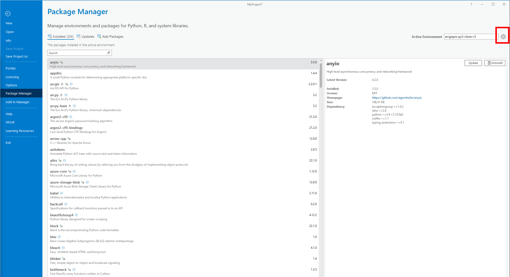
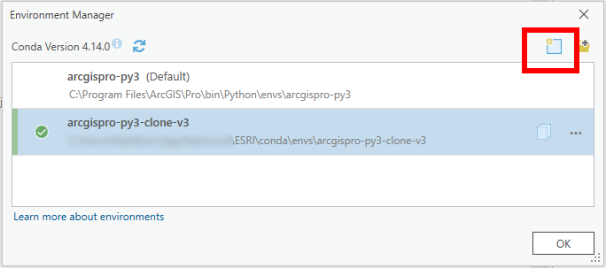
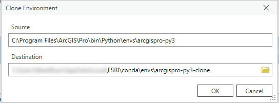
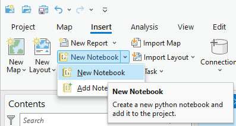
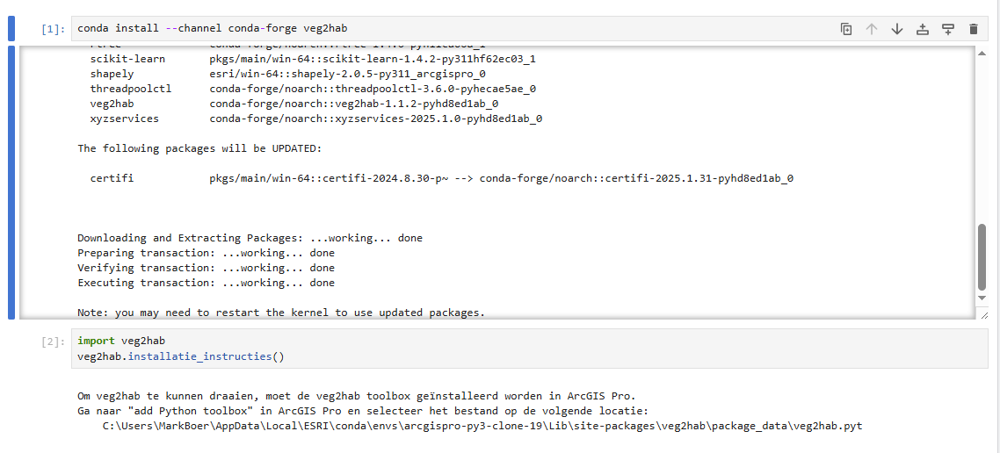
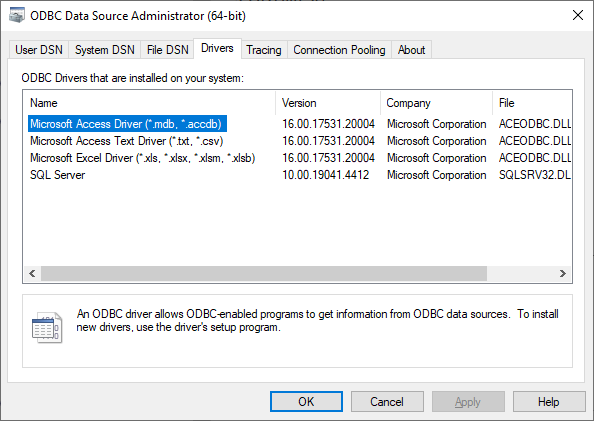

# veg2hab

- [veg2hab](#veg2hab)
  - [Introductie](#introductie)
    - [Disclaimer](#disclaimer)
  - [Installatie instructies](#installatie-instructies)
    - [Installatie binnen ArcGIS Pro](#installatie-binnen-arcgis-pro)
      - [Aanvullende opmerkingen](#aanvullende-opmerkingen)
    - [Installatie .mdb drivers op Windows](#installatie-mdb-drivers-op-windows)
    - [Installatie veg2hab op linux](#installatie-veg2hab-op-linux)
  - [Gebruikershandleiding](#gebruikershandleiding)
    - [Gebruik in ArcGIS Pro](#gebruik-in-arcgis-pro)
    - [Bronbestanden die veg2hab gebruikt](#bronbestanden-die-veg2hab-gebruikt)
  - [Handleiding voor ontwikkelaars](#handleiding-voor-ontwikkelaars)
    - [Lokale ontwikkeling](#lokale-ontwikkeling)
    - [Nieuwe release](#nieuwe-release)
  - [Interpretatie van de output-habitattypekartering](#interpretatie-van-de-output-habitattypekartering)
    - [Vlakbrede kolommen](#vlakbrede-kolommen)
    - [Complex-deel-specifieke kolommen](#complex-deel-specifieke-kolommen)

## Introductie

**veg2hab** zet Nederlandse vegetatietypekarteringen automatisch om naar habitattypekarteringen. De library kan op 2 manieren gebruikt worden:

- Als functionaliteit binnen andere (python) software;
- Vanuit ArcGIS Pro.

veg2hab wordt gedistribueerd via PyPI, waar alle toekomstige versies aan toe worden gevoegd.

### Disclaimer

Veg2hab is bedoeld als hulpmiddel om sneller vegetatiekarteringen om te zetten naar concept habitattypekaarten. Na de omzetting door veg2hab is over het algemeen nog handwerk van de gebruiker nodig, omdat sommige beperkende criteria niet te automatiseren zijn en expert judgment vereisen. Veg2hab geeft vlakken die het niet automatisch een habittatype (of `H0000`) kan toekennen de code `Hxxxx`, en beschrijft in de output welke controles de gebruiker handmatig moet doen. 

Het wordt gebruikers sterk aangeraden om:
- het rapport van een vegetatiekartering door te lezen, om te controleren of er zaken expliciet afwijken van de typologie vertalingen in de was-wordt lijst, de profieldocumenten of de omzetregels uit het methodiekdocument.
- De output van veg2hab steekproefsgewijs na te lopen, om te zien of de omzetting strookt met de verwachting en kennis over het gebied.
- Na het toepassen van de beperkende criteria het tussenproduct na te lopen en handmatig `Hxxxx` om te zetten naar `H0000` of een habitattype, om pas daarna de mozaiekregels en functionele samenhang toe te passen.

## Installatie instructies

### Installatie binnen ArcGIS Pro

Gebruik van veg2hab is ontwikkeld voor en getest in ArcGIS Pro versie 3.0 en hoger. Voor oudere versies 
Installatie vanaf PyPI is veruit het eenvoudigst, en wordt hieronder omschreven:

 1. Open ArcGIS Pro.
 2. Maak een nieuwe python environment aan voor veg2hab (de default conda environment is read-only en niet geschikt om veg2hab in te installeren):
    - Open de 'Package Manager'.  
        
    - Klik op het tandwiel naast 'Active Environment'.
    - Maak een nieuwe environment aan op een locatie naar keuze. Gebruik als 'Source' de default Environment.  
        
        
    - Selecteer de environment en druk op 'OK'.
    - Let op: het aanmaken van een nieuwe environment kan langer dan 5 minuten duren. De status van het aanmaken kan bekeken worden onder `Tasks` rechtsonderin de Package Manager.
 3. Start ArcGIS Pro opnieuw op.
 4. Download en installeer veg2hab:
    - Klik op 'New notebook' en wacht tot deze is opgestart. Dit kan tot een minuut duren.  
        
    - Download veg2hab met het commando `!pip install --upgrade veg2hab`. Het uitvoeren van een commandoregel in het notebook kan gedaan worden met `Control`+`Enter` of door te klikken op de `Run` knop. Tijdens het uitvoeren staat er links naast de commandoregel `[*]`. Dit sterretje verandert in een getal wanneer het notebook klaar is. Het installeren van veg2hab kan enkele minuten duren.  
        
 4. Activeer veg2hab in het notebook met het commando `import veg2hab`.
 5. Installeer de veg2hab Python Toolbox:
    - Gebruik het commando `veg2hab.installatie_instructies()` om de locatie van de toolbox te vinden.
    - Ga naar 'Add Toolbox (file)' en voeg de toolbox toe vanaf de locatie.  
        

Als het goed is, wordt de veg2hab toolbox nu getoond in de Geoprocessing tab:


#### Aanvullende opmerkingen

- In sommige gevallen heeft de gebruiker een ArcGIS Pro omgeving die beheerd wordt door de organisatie, en heeft de gebruiker zelf niet de rechten om alle installatiestappen uit te voeren. Alle stappen tot en met het installeren van veg2hab zullen daarbij door de IT afdeling van de organisatie uitgevoerd worden. De gebruiker moet daarna zelf alleen nog veg2hab activeren en de Toolbox installeren.
- Wanneer veg2hab geïmporteerd is en de toolbox is toegevoegd, kan deze instelling bewaard worden door het project op te slaan. Bij opnieuw openen van het project zal veg2hab direct beschikbaar zijn.


### Installatie .mdb drivers op Windows
veg2hab heeft 64-bit drivers nodig voor het openen van Microsoft Access Database bestanden (.mdb). Meestal zijn deze drivers al geïnstalleerd. Dit kan gecontroleerd worden in de `ODBC Data Source Administrator`: 




Als er nog geen driver voor .mdb files is geïnstalleerd, kunnen de volgende stappen gevolgd worden (zie ook [deze video](https://www.youtube.com/watch?v=biSjA8ms_Wk)):

1. Open het ODBC Data Sources window voor 64 bit.
2. Klik op `Add...`
3. Selecteer `Microsoft Access Driver (*.mdb, *.accdb)` en klik op `Finish`.
4. Geef de source een naam naar keuze en klik op `OK`.


### Installatie veg2hab op linux
Op linux heeft veg2hab een extra dependency. Pyodbc kan namelijk niet overweg met .mdb files op linux, dus gebruiken we hiervoor de `mdb-export` tool. Deze is te installeren met:
```sh
apt install mdbtools
```
voor meer informatie, zie: https://github.com/mdbtools/mdbtools

## Gebruikershandleiding

### Gebruik in ArcGIS Pro

De omzetting van veg2hab van vegetatiekarteringen naar habitattypekaarten gebeurt in tools in de veg2hab Python Toolbox. Om de omzetting te doen, dient de gebruiker eerst de betreffende vegetatiekarteringen in te laden als kaart in ArcGIS Pro.

De omzettool komt in twee smaken:
1. `digitale_standaard`, voor het omzetten van vegetatiekarteringen die de landelijke digitale standaard gebruiken, die bestaat uit een shapefile gecombineerd met een access database. De gebruiker voert in welke vegetatiekarteringen omgezet moet worden en waar de bijhorende access database te vinden is.
2. `vector_bestand`, voor het omzetten van vegetatiekarteringen die alle benodigde informatie in de shapefile zelf bevatten. Omdat shapefiles geen standaard kolomnamen hebben, dient de gebruiker hier een handvol inputvelden in te vullen, bijvoorbeeld welke kolom de te gebruiken landelijke typologie bevat.

Let op:
- Wanneer de gebruiker beschikt over een access database, raden wij aan de  `digitale_standaard` omzetting te gebruiken, ook als de shapefile alle informatie bevat. Hierbij is de kans op handmatige fouten kleiner.
- Vegetatiekarteringen die omgezet worden met `vector_bestand` moeten beschikken over een landelijke typologie (SBB, VvN of rVvN).
- De eerste keer dat (een nieuwe versie van) veg2hab gebruikt wordt, worden er automatisch een aantal grote bestanden gedownload, waaronder de Landelijke Bodem Kaart. Deze download kan enkele minuten duren, afhankelijk van de internetverbinding.


### Bronbestanden die veg2hab gebruikt

veg2hab is afhankelijk van verschillende bronbestanden tijdens het omzetten van vegetatiekarteringen. Deze bestanden worden automatisch mee geïnstalleerd met veg2hab en zijn niet aanpasbaar door de gebruiker:

 - [WasWordtLijst](./data/5.%20Was-wordt-lijst-vegetatietypen-en-habitattypen-09-02-2021.xlsx) (versie 09-feb-2021): dit bestand wordt gebruikt om landelijke vegetatietypologieën in elkaar om te zetten.
 - [DefinitieTabel](./data/definitietabel%20habitattypen%20(versie%2024%20maart%202009)_0.xls) (versie 24 maart 2009): dit is een samenvatting van de profieldocumenten.
 - [Fysisch-Geografische Regio kaart](./data/bronbestanden/FGR.json) (versie 2013, [link naar origineel op Nationaal georegister](https://nationaalgeoregister.nl/geonetwork/srv/dut/catalog.search#/metadata/c8b5668f-c354-42f3-aafc-d15ae54cf170)).
 - [Landelijke Bodem Kaart](https://bodemdata.nl/downloads) (versie 2023): dit bestand wordt gebruikt voor het controleren van beperkende criteria met betrekking tot sommige bodemtypen en hoogveen.

Let op: bij volgende versies van veg2hab komen er mogelijk meer bronbestanden bij.


## Handleiding voor ontwikkelaars
### Lokale ontwikkeling
Download de git repository:
```sh
git clone https://github.com/Spheer-ai/veg2hab
```

En installeer alle lokale (developmment) dependencies met:
```sh
poetry install
```

Binnen het project zijn onderstaande stappen gevolgd om deze data in te lezen:
- Clone de volgende repo: https://github.com/pavlov99/mdb-export-all
- Gebruik het bash script om .mdb files om te zetten naar een map met csv bestanden
- De SBB-codes staan in Element.csv

Linting doen we met isort en black:
```sh
poetry run black .
poetry run isort .
```

Unittests worden gedraaid met pytest:
```sh
poetry run pytest tests/
```

### Nieuwe release
1. Zorg ervoor dat de laatste bronbestanden in package_data staan met `poetry run python release.py create-package-data`
2. Maak een nieuwe versie met poetry (major, minor, patch): `poetry version {{rule}}`
3. Pas de [\_\_init\_\_.py](veg2hab/__init__.py) __version__ variabele aan zodat deze overeen komt met de nieuw poetry version.
4. Pas [veg2hab.pyt](veg2hab/package_data/veg2hab.pyt) zodat de nieuwe version in SUPPORTED_VERSIONS staat. Heb je aanpassingen gedaan aan veg2hab.pyt sinds de laatste release, zorg er dan voor dat de `SUPPORTED_VERSIONS = [{{new_version}}]` wordt gezet.
5. Draai `python release.py check-versions` om te checken dat je geen fouten hebt gemaakt.
6. Push nu eerst je nieuwe wijzigingen (mochten die er zijn), naar github: (`git add`, `git commit`, `git push`)
7. Maak een nieuwe tag: `git tag v$(poetry version -s)`
8. Push de tag naar git `git push origin tag v$(poetry version -s)`
9. Github actions zal automatisch de nieuwe versie op PyPI zetten.


## Interpretatie van de output-habitattypekartering

### Vlakbrede kolommen
**Area**: Oppervlakte van het gehele vlak in m2.

**Opm**: Opmerkingen bij dit vlak vanuit de bronkartering, als hier een opmerkingenkolom bij is opgegeven.

**Datum**: Datum vanuit de bronkartering, als hier een datumkolom bij is opgegeven.

**ElmID**: Een voor ieder vlak uniek ID. Deze kan vanuit de bronkartering komen, maar kan ook nieuw zijn gegenereerd. Dit gebeurt de als ElmID (of een ElmID equivalent zoals OBJECTID) in de bronkartering niet voor ieder vlak uniek is; als dit het geval is is hierover een warning gegeven.

**_Samnvttng**: Weergave van hoeveel procent van het vlak bedekt is met welk habitattype. Dit is een combinatie van alle kolommen `Habtype{i}` en `Perc{i}`.

**_LokVegTyp**: Het in de bronkartering opgegeven lokale vegetatietype, als er een lokaal vegetatietype kolom is opgegeven.

**_LokVrtNar**: Of de oorspronkelijk opgegeven lokale vegetatietypen in de bronkartering primair is vertaald naar SBB, VvN of beide. Als er naar SBB is vertaald, zijn er bijbehorende VvN uit de waswordtlijst gehaald. Als er naar VvN of naar beide is vertaald, is dit niet gedaan.

### Complex-deel-specifieke kolommen
**Habtype{i}**: Habitattype van het complex-deel. HXXXX hier betekend dat er menselijk oordeel nodig is over dit complex-deel.

**Perc{i}**: Percentage van het gehele vlak wat door dit complex-deel wordt bedekt.

**Opp{i}**: Oppervlakte van dit complex-deel in m2.

**Kwal{i}**: Kwaliteit van dit complex-deel. Dit kan zijn G (goed), M (matig) of X (nvt).

**Opm{i}**: Korte uitleg van hoe Veg2Hab tot het habitattype van dit complex-deel is gekomen.

**VvN{i}**/**SBB{i}**: De VvN/SBB-code die het gegeven habitattype onderbouwt, als deze er is. Dit is normaal gesproken het vegetatietype wat in de definitietabel tot het gegeven habitattype leidt. Als H0000 gegeven is, zullen alle in de definitietabel gevonden vegetatietypen weergegeven zijn. In het geval van HXXXX worden hier vegetatietypen vermeld van het meest specifieke niveau wat in de definitietabel is gevonden.

**_Status{i}**: Interne beslissings-status van Veg2Hab voor dit complex-deel. Wat de opgegeven status betekend is samengevat in `_Uitleg{i}`. Mogelijke statussen en hun uitleg zijn:
- `DUIDELIJK`: Als alle regels gevolgd worden is er 1 duidelijke optie; er is maar 1 habitatvoorstel met kloppende mits/mozaiek.
- `GEEN_KLOPPENDE_MITSEN`: Er is geen habitatvoorstel met kloppende mits/mozaiek. Er kan dus geen habitattype toegekend worden.
- `VEGTYPEN_NIET_IN_DEFTABEL`: De vegetatietypen van het vlak zijn niet in de definitietabel gevonden en leiden dus niet tot een habitattype.
- `GEEN_OPGEGEVEN_VEGTYPEN`: Er zijn in de vegetatiekartering geen (habitatwaardige)vegetatietypen opgegeven voor dit vlak. Er is dus geen habitattype toe te kennen.
- `MEERDERE_KLOPPENDE_MITSEN`: Er zijn meerdere habitatvoorstellen met kloppende mits/mozaiek. Er is geen duidelijke keuze te maken.
- `PLACEHOLDER`: Er zijn placeholder mitsen/mozaiekregels gevonden; deze kunnen (nog) niet door Veg2Hab worden gecontroleerd.
- `WACHTEN_OP_MOZAIEK`: Er is te weinig informatie over de habitattypen van omliggende vlakken (teveel HXXXX)

**_Uitleg{i}**: Uitleg van de status van dit complex-deel.

**_VgTypInf{i}**: De SBB en VvN typen van dit complex-deel uit de bronkartering. Als de bronkartering geen VvN had, zijn deze er via de waswordtlijst bijgezocht.

**_Mits_opm{i}**/**_Mozk_opm{i}**: Hier staat informatie over de mitsen/mozaiekregels die in definitietabelregels gevonden zijn. Wat hier staat hangt af van de status van het complex-deel:
- `DUIDELIJK`: Hier staat de mits/mozaiekregel weergegeven die tot het habitattype heeft geleid. Deze kloppen beide.
- `GEEN_KLOPPENDE_MITSEN`: Hier staan de mitsen/mozaiekregels van alle definitietabelregels die gevonden zijn in de definitietabel. Deze zijn in dit geval allemaal niet kloppend.
- `VEGTYPEN_NIET_IN_DEFTABEL`: Er zijn geen regels in de definitietabel gevonden voor de huidige vegetatietypen, dus er worden ook geen mitsen/mozaiekregels weergegeven.
- `GEEN_OPGEGEVEN_VEGTYPEN`: Er zijn geen vegetatietypen opgegeven voor dit vlak, dus er worden ook geen mitsen/mozaiekregels weergegeven.
- `MEERDERE_KLOPPENDE_MITSEN`: Hier staan alle kloppende mitsen/mozaiekregels van het meest specifieke niveau waar kloppende definitietabelregels voor gevonden zijn.
- `PLACEHOLDER`: Hier staan alle mitsen/mozaiekregels van definitietabelregels die maximaal even specifiek zijn als de meest specifieke placeholder mits.
- `WACHTEN_OP_MOZAIEK`: Hier staan alle mitsen/mozaiekregels van definitietabelregels die maximaal even specifiek zijn als de meest specifieke mozaiekregel.

In alle gevallen is achter elke mits weergegeven of deze klopt (`TRUE`), niet klopt (`FALSE`), of niet door Veg2Hab beoordeeld kan worden (`CANNOT_BE_AUTOMATED`). Een moziekregel kan ook nog uitgesteld zijn (`POSTPONE`); in dit geval is er te weinig informatie over de habitattypen van omliggende vlakken, omdat deze nog te veel HXXXX hebben om een mozaiekregeloordeel te kunnen vellen.

**_MozkPerc{i}**: Als dit complex-deel een mozaiekregel heeft, zijn hier de omringingspercentages van aangenzende habitattypen weergegeven. De getoonde percentages zijn diegene die gebruikt zijn om de mozaiekregel te beoordelen. Aangezien het mogelijk is dat een mozaiekregel beoordeeld kan worden voordat alle omliggende vlakken al een habitattype hebben gekregen (bijvoorbeeld als er al 50% van een verkeerd habitattype omheen ligt), kloppen deze soms niet met wat uiteindelijk om het vlak ligt (er kan meer HXXXX staan dan in de output kartering zo is).

**_VvNdftbl{i}**/**_SBBdftbl{i}**: Dit zijn de regels in de definitietabel waar de opgegeven mitsen/mozaiekregels te vinden zijn, opgesplitst in VvN en SBB regels.
